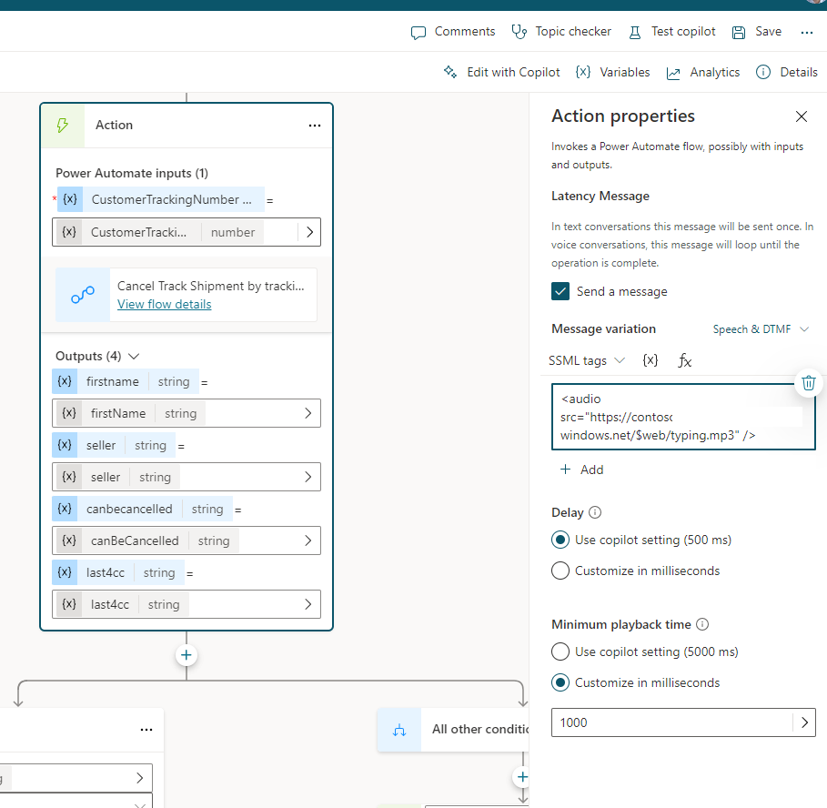

# Add playing MP3 file when operation to backend takes long
Integrated Power Automate flow within your IVR may require time to run.
You have the option of delivering a message during the operation or a file, such as a recording that simulates a typing sound.
Incorporation of files with SSML is feasible. As an illustration:


<picture>
 
</picture>

Here is a SSML code example
```
<audio src="https://contoso.com/$web/typing.mp3"/>
```
Hint: you can use Azure Static Web Site in the Azure Storage account to host files. 
